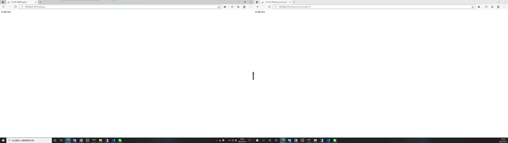

## 简介

[CherryPy](http://www.cherrypy.org/) 是一个 pythonic 的，面向对象的 Web 框架。CherryPy 允许开发人员以与构建任何其他面向对象的 Python 程序相同的方式构建 Web 应用程序。可以在更短的时间内开发出更小的源代码。

CherryPy 应用程序通常如下所示：

```python
import cherrypy

class HelloWorld:
    # CherryPy 绝不会发布未将 `expose` 属性设置为 `True` 的方法
    # 在 Web 中公开 index 方法
    @cherrypy.expose
    def index(self):
        # CherryPy 将为根 URI（"/"）调用此方法，并将其返回值发送给客户端
        return "Hello World!"

# 在尝试将请求 URI 映射到对象时，CherryPy 始终以 `app.root` 开始，
# 因此我们需要挂载请求处理程序根。 对 `'/'` 的请求将映射到 `HelloWorld().index()`。
cherrypy.quickstart(HelloWorld())
```

为了充分利用 CherryPy，您应该从[教程](https://docs.cherrypy.org/en/latest/tutorials.html#tutorials)开始，它将指导您完成框架的最常见方面。完成后，您可能需要浏览[基础](https://docs.cherrypy.org/en/latest/basics.html#basics)和[高级](https://docs.cherrypy.org/en/latest/advanced.html#advanced)部分，以演示如何实现某些操作。最后，您将需要仔细阅读配置和[扩展](https://docs.cherrypy.org/en/latest/extend.html#extend)部分，那是有关框架提供的强大功能的更深入的内容。

## 架构解析

CherryPy 不是由一层组成，而是由四个独立的 API 层组成。

<article>
    <link rel="stylesheet" href="https://xinetzone.github.io/w3css/4/w3.css">
    <link rel="stylesheet" href="https://xinetzone.github.io/xinet-css/tabs.css">
    <div class="tab-set w3-light-grey">
        <input checked="True" id="tab-set--0-input--1" name="tab-set--0" type="radio">
        <label for="tab-set--0-input--1">应用层</label>
        <div class="tab-content w3-padding">
            <p>
                <strong>应用层</strong>是最简单的。CherryPy 应用程序被编写为类和方法的树，其中树中的每个分支都对应于 URL 路径中的一个分支。每个方法都是一个“page
                handler”，它接收 GET 和 POST 参数作为关键字参数，并返回或产生 response
                的（HTML）主体（body）。特殊方法名称“index”用于以斜杠结尾的路径，特殊方法名称“default”用于通过单个处理程序处理多个路径。该层还包括：
            <ul>
                <li><code>exposed</code> 属性 (和 <code>cherrypy.expose</code>)</li>
                <li><code>cherrypy.quickstart()</code></li>
                <li><code>_cp_config attributes</code></li>
                <li><code>cherrypy.tools</code> (包括 <code>cherrypy.session</code>)</li>
                <li><code>cherrypy.url()</code></li>
            </ul>
            </p>
        </div>
        <input id="tab-set--0-input--2" name="tab-set--0" type="radio">
        <label for="tab-set--0-input--2">环境层</label>
        <div class="tab-content w3-padding">
            <p>
                开发人员在各个级别都使用“<strong>环境层</strong>”。它通过一组（默认）顶级（top-level）对象提供有关当前请求和响应以及应用程序和服务器环境的信息：
            <ul>
                <li><code>cherrypy.request</code></li>
                <li><code>cherrypy.response</code></li>
                <li><code>cherrypy.engine</code></li>
                <li><code>cherrypy.server</code></li>
                <li><code>cherrypy.tree</code></li>
                <li><code>cherrypy.config</code></li>
                <li><code>cherrypy.thread_data</code></li>
                <li><code>cherrypy.log</code></li>
                <li><code>cherrypy.HTTPError</code>, <code>NotFound</code>, 和 <code>HTTPRedirect</code></li>
                <li><code>cherrypy.lib</code></li>
            </ul>
            </p>
        </div>
        <input id="tab-set--0-input--3" name="tab-set--0" type="radio">
        <label for="tab-set--0-input--3">扩展层</label>
        <div class="tab-content w3-padding">
            <p>
                <strong>扩展层</strong>允许高级用户构造和共享他们自己的插件。它包括：
            <ul>
                <li><code>Hook</code> API</li>
                <li><code>Tool</code> API</li>
                <li><code>Toolbox</code> API</li>
                <li><code>Dispatch</code> API</li>
                <li>Config Namespace API</li>
            </ul>
            </p>
        </div>
        <input id="tab-set--0-input--4" name="tab-set--0" type="radio">
        <label for="tab-set--0-input--4">核心层</label>
        <div class="tab-content w3-padding">
            <p>
                <strong>核心层</strong> 使用核心 API 来构造可在更高层使用的默认组件。您可以将默认组件视为 CherryPy
                的“参考实现”。Megaframeworks（和高级用户）可以用自定义或扩展组件替换默认组件。核心 API 是：
            <ul>
                <li>Application API</li>
                <li>Engine API</li>
                <li>Request API</li>
                <li>Server API</li>
                <li>WSGI API</li>
            </ul>
            </p>
        </div>
    </div>
</article>

这些 API 在 [CherryPy 规范](https://github.com/cherrypy/cherrypy/wiki/CherryPySpec) 中进行了描述。

## 使用手册

首先了解一些基础知识。

### 基础教程

下面的示例演示了用 CherryPy 编写的最基本的应用程序。它启动一个服务器并托管一个应用程序，该应用程序将在请求时提供服务到 <http://127.0.0.1:8080/>。

```python
import cherrypy

class HelloWorld:
    @cherrypy.expose
    def index(self):
        return "你好世界！"

cherrypy.quickstart(HelloWorld())
```

此时，终端可以看到：


这告诉你一些事情。前三行表示服务器将处理 [`signal`](https://docs.python.org/3/library/signal.html#module-signal "(在 Python v3.8)") 。下一行告诉您服务器的当前状态，因为此时服务器处于 `STARTING` 阶段。然后，系统会通知您的应用程序没有为其设置特定的配置。接下来，服务器启动一些内部实用程序，稍后我们将对此进行解释。最后，服务器表明它现在已经准备好接受传入的通信，因为它正在监听地址 `127.0.0.1:8080`。换句话说，在那个阶段，您的应用程序就可以使用了。

然后，在浏览器打开输入网址： <http://127.0.0.1:8080/>，可以看到：


#### [不同的函数产生不同的 URL](https://docs.cherrypy.org/en/latest/tutorials.html#id5)

显然，您的应用程序可能会处理多个 URL。假设您有一个应用程序，每次调用它时都会生成一个随机字符串：

```python
import random
import string

import cherrypy


class StringGenerator:
    @cherrypy.expose
    def index(self):
        return "你好世界！"

    @cherrypy.expose
    def generate(self):
        return ''.join(random.sample(string.hexdigits, 8))


if __name__ == '__main__':
    cherrypy.quickstart(StringGenerator())
```

现在转到 `http://localhost:8080/generate`，您的浏览器将显示一个随机字符串。


让我们花一分钟时间来分解这里发生的事情。这是您在浏览器中键入的 URL: [http://localhost:8080/generate](http://localhost:8080/generate)

此 URL 包含多个部分：

*   `http://` 这大致表明它是一个使用 HTTP 协议的 URL（请参见 [**RFC 2616**](https://tools.ietf.org/html/rfc2616.html) ）

*   `localhost:8080` 是服务器的地址。它由主机名和端口组成。

*   `/generate` 它是 URL 的路径段。这就是 CherryPy 用来定位 [exposed](https://docs.cherrypy.org/en/latest/glossary.html#term-exposed) 响应的函数或方法。

在这里，CherryPy 使用 [`index()`](https://docs.cherrypy.org/en/latest/pkg/cherrypy.lib.covercp.html#cherrypy.lib.covercp.CoverStats.index "cherrypy.lib.covercp.CoverStats.index") 方法处理 `/` 以及 `generate()` 方法处理 `/generate`。

当然也可以是中文作为方法名称，比如：

```python
import random
import string

import cherrypy


class StringGenerator:
    @cherrypy.expose
    def index(self):
        return "你好世界！"

    @cherrypy.expose
    def 生成(self):
        return ''.join(random.sample(string.hexdigits, 8))


if __name__ == '__main__':
    cherrypy.quickstart(StringGenerator())
```

此时，将创建子路径 `http://localhost:8080/生成`（不推荐使用中文）。

#### [设置 URL 的参数](https://docs.cherrypy.org/en/latest/tutorials.html#tutorial-3-my-urls-have-parameters "Permalink to this headline")

在前面的教程中，我们已经了解如何创建可以生成随机字符串的应用程序。现在假设您希望动态地指示该字符串的长度。

```python
import string
import random
import cherrypy


class StringGenerator:
    @cherrypy.expose
    def index(self):
        return "你好世界！"

    @cherrypy.expose
    def generate(self, length=8):
        return ''.join(random.sample(string.hexdigits, int(length)))


if __name__ == '__main__':
    cherrypy.quickstart(StringGenerator())
```

现在转到 `http://localhost:8080/generate?length=16`，浏览器将显示长度为 16 的生成字符串。请注意，我们也可以从 Python 的默认参数值中获益，以支持 URL，如 `http://localhost:8080/generate`。

在这样的 URL 中，后面的部分 `?` 称为查询字符串。一般地，查询字符串通过传递一组（键、值）对来将 URL 上下文化（contextualize）。它们的格式是 `key=value`，且使用 `&` 分隔。

注意我们必须转换给定的 `length` 值为整数。实际上，值是作为字符串从客户端发送到服务器的。

与 CherryPy 将 URL 路径段映射到公开的函数很相似，查询字符串键映射到公开的函数参数。

下面介绍一些进阶是教程。

### 简单的配置

在继续之前，让我们讨论一下关于配置的消息。默认情况下，CherryPy 有一个特性，它将检查配置应用程序时可以提供的设置的语法正确性。如果没有提供，日志中将显示警告消息。那根原木是无害的，不会阻止 CherryPy 工作。你可以参考 [配置的文档](https://docs.cherrypy.org/en/latest/basics.html#perappconf) 了解如何设置配置。

函数 `quickstart(root=None, script_name='', config=None)`，利用参数 `config` 可以修改一些配置参数。

`config` 可以是包含应用程序配置的文件或字典（`dict`）。如果包含 `[global]` 部分，这些配置项将在（站点范围内） `global` 中使用配置。下面创建一个配置文件 `base-server.conf`，内容如下：

```toml
[global]
server.socket_host = "127.0.0.1"
server.socket_port = 9999
server.thread_pool = 10
```

这样，便可以修改默认的端口为 `9999`：

```python
import cherrypy

class HelloWorld:
    # CherryPy 绝不会发布未将 `expose` 属性设置为 `True` 的方法
    # 在 Web 中公开 index 方法
    @cherrypy.expose
    def index(self):
        # CherryPy 将为根 URI（"/"）调用此方法，并将其返回值发送给客户端
        return "Hello World!"

config = 'configs/base-server.conf' # 这里也可以是 dict 形式
cherrypy.quickstart(HelloWorld(), config=config)
```

### 创建 HTML 模板

CherryPy 是用于构建 Web 应用程序的 Web 框架。应用程序采用的最传统的形式是通过与 CherryPy 服务器通信的 HTML 用户界面。为此，可以创建一个载入 HTML 模板，加快软件开发效率。

1. 我们借助 [`string`](https://docs.python.org/3/library/string.html).`Template` 创建一个基础的 HTML 模板 `base.html`：

```html
<!DOCTYPE html>
<html lang="${lang}">

<head>
    <meta charset="UTF-8">
    <meta name="viewport" content="width=device-width, initial-scale=1.0">
    <title>${title}</title>
</head>

<body>
    ${body}
</body>

</html>
```

2. 接着，创建该模板的初始化配置文件 `base.toml`：

```toml
lang = 'zh-CN'
title = 'Web 模板'
body = '<h1>环艺</h1>'
```

3. 创建可以载入模板 HTML 和配置文件的函数：

```python
from string import Template
import toml


class Bunch(dict):
    def __init__(self, **kw):
        super().__init__(**kw)
        self.__dict__ = self


def load_option(path):
    opt = toml.load(path)
    return Bunch(**opt)


def load_template(path):
    with open(path, encoding='utf-8') as fp:
        h5 = fp.read()
    return Template(h5)
```

4. 创建解析 HTML 模板的类和函数：

```python
class Template:
    def __get__(self, obj, objtype=None):
        path = obj.template_path
        if path:
            return load_template(path)
        else:
            return {}


class Html:
    template = Template()

    def __init__(self, template_path, config_path):
        self.template_path = template_path
        self._config_path = config_path
        self._configure = self.reset()

    def reset(self):
        path = self._config_path
        if path:
            return load_option(path)
        else:
            return {}

    @property
    def config(self):
        return self._configure

    def __repr__(self):
        return self.template.substitute(self.config)

    def encode(self, encoding='utf-8'):
        return repr(self).encode(encoding)

    def update(self, config):
        self.config.update(config)
```

自此，便完成对 HTML 的解析，使用如下：

```python
template_path = 'templates/base.html'
config_path = 'configs/base.toml'

html = Html(template_path, config_path)
html
```

输出：

```html
<!DOCTYPE html>
<html lang="zh-CN">

<head>
    <meta charset="UTF-8">
    <meta name="viewport" content="width=device-width, initial-scale=1.0">
    <title>Web 模板</title>
</head>

<body>
    
</body>

</html>
```

5. 调用服务器：

```python
import cherrypy
from app.htmlx import Html


class TemplateHtml(Html):
    def __init__(self, template_path, config_path):
        super().__init__(template_path, config_path)

    @cherrypy.expose
    def index(self):
        yield self.encode('utf-8')

template_path = 'templates/base.html'
config_path = 'configs/base.toml'
config = 'configs/base-server.conf'
httpd = TemplateHtml(template_path, config_path)
d = {'body': '''<h1>欢迎进入 Web 世界 <h1>
<p>CherryPy</p>
'''}
httpd.update(d) # 更新 HTML
cherrypy.quickstart(httpd, config=config)
```

### 提交表单

创建 HTML 模板：

```html
<!DOCTYPE html>
<html lang="${lang}">

<head>
    <meta charset="UTF-8">
    <meta name="viewport" content="width=device-width, initial-scale=1.0">
    <title>${title}</title>
</head>

<body>
    <form method="get" action="generate">
        <label for="gen">字符串的长度：</label>
        <input type="text" id="gen" value="8" name="length">
        <button type="submit">Give it now!</button>
    </form>
</body>

</html>
```

编写一个 GET 请求：

```python
import random
import string

import cherrypy
from app.htmlx import Html


class TemplateHtml(Html):
    def __init__(self, template_path, config_path):
        super().__init__(template_path, config_path)

    @cherrypy.expose
    def index(self):
        yield self.encode('utf-8')

    @cherrypy.expose
    def generate(self, length=8):
        return ''.join(random.sample(string.hexdigits, int(length)))

    def quickstart(self, script_name='', app_config=None):
        cherrypy.quickstart(self, script_name, app_config)


template_path = 'templates/form.html'
config_path = 'configs/form.toml'
config = 'configs/base-server.conf'
httpd = TemplateHtml(template_path, config_path)
httpd.quickstart(app_config=config)
```

请注意，在此示例中，表单使用 `GET` 方法，并且当您按下 `Give it now!` 按钮，使用与上一教程相同的 URL 发送表单。HTML 表单还支持 `POST` 方法，在这种情况下，查询字符串不会附加到 URL，而是作为客户端请求主体发送给服务器的。但是，这不会更改您应用程序的 `exposed` 方法，因为 CherryPy 以相同的方式处理这两种情况，并使用 `exposed` 的处理程序参数来处理查询字符串 `(key, value)` 对。

### [跟踪最终用户的活动](https://docs.cherrypy.org/en/latest/tutorials.html#id8)

应用程序需要一段时间跟踪用户的活动并不少见。通常的机制是使用在用户和您的应用程序之间的对话过程中携带的 [会话标识符](http://en.wikipedia.org/wiki/Session_(computer_science)#HTTP_session_token)。

需要修改服务器的配置（`configsbase-server.toml`）：

```toml
[global]
server.socket_host = "127.0.0.1"
server.socket_port = 9999
server.thread_pool = 10

[/]
tools.sessions.on: True
```

使用下面的代码启动服务器：

```python
import random
import string

import cherrypy
from app.htmlx import Html


class TemplateHtml(Html):
    def __init__(self, template_path, config_path):
        super().__init__(template_path, config_path)

    @cherrypy.expose
    def index(self):
        yield self.encode('utf-8')

    @cherrypy.expose
    def generate(self, length=8):
        some_string = ''.join(random.sample(string.hexdigits, int(length)))
        cherrypy.session['mystring'] = some_string
        return some_string

    @cherrypy.expose
    def display(self):
        return cherrypy.session['mystring']

    def quickstart(self, script_name='', config=None):
        cherrypy.quickstart(self, script_name, config)


template_path = 'templates/form.html'
config_path = 'configs/form.toml'
config = 'configs/base-server.conf'
httpd = TemplateHtml(template_path, config_path)
httpd.quickstart(config=config)
```

最终的效果是：


在本例中，我们生成的字符串并存储在当前会话中。如果您转到 `http://localhost:8080/`，生成一个随机字符串，然后转到 `http://localhost:8080/display`，您将看到刚刚生成的字符串。

其中 `tools.sessions.on: True` 向您展示了如何在 CherryPy 应用程序中启用会话支持。默认情况下，CherryPy 会将会话保存在进程的内存中。[backends](https://www.osgeo.cn/cherrypy/basics.html#basicsession) 提供更持久的支持。

<article>
    <div class="tab-set w3-light-grey">
        <input checked id="tab-set--1-input--1" name="tab-set--1" type="radio">
        <label for="tab-set--1-input--1">Input</label>
        <div class="tab-content w3-padding">
            
        </div>
        <input id="tab-set--1-input--2" name="tab-set--1" type="radio">
        <label for="tab-set--1-input--2">Output</label>
        <div class="tab-content w3-padding">
            
        </div>
    </div>
</article>

### [关于 JavaScripts, CSS 和 图片](https://docs.cherrypy.org/en/latest/tutorials.html#tutorial-6-what-about-my-javascripts-css-and-images "Permalink to this headline")

Web 应用程序通常由静态内容组成，如 JavaScript、CSS 文件或图像。CherryPy 提供了为最终用户提供静态内容的支持。

假设您希望将样式表与应用程序关联，以显示蓝色背景色。

首先，将以下样式表保存到名为 `main.css` 并存储到本地目录中 `public/css`。

```css
body {
    background-color: blue;
}
```

模板 HTML 则为：

```html
<!DOCTYPE html>
<html lang="${lang}">

<head>
    <meta charset="UTF-8">
    <meta name="viewport" content="width=device-width, initial-scale=1.0">
    <title>${title}</title>
    <link href="/static/css/main.css" rel="stylesheet">
</head>

<body>
    <form method="get" action="generate">
        <label for="gen">字符串的长度：</label>
        <input type="text" id="gen" value="8" name="length">
        <button type="submit">Give it now!</button>
    </form>
</body>

</html>
```

服务器代码：

```python
import random
import string
import os

import cherrypy
from app.htmlx import Html


class TemplateHtml(Html):
    def __init__(self, template_path, config_path):
        super().__init__(template_path, config_path)

    @cherrypy.expose
    def index(self):
        yield self.encode('utf-8')

    @cherrypy.expose
    def generate(self, length=8):
        some_string = ''.join(random.sample(string.hexdigits, int(length)))
        cherrypy.session['mystring'] = some_string
        return some_string

    @cherrypy.expose
    def display(self):
        return cherrypy.session['mystring']

    def quickstart(self, script_name='', server_config=None):
        cherrypy.quickstart(self, script_name, server_config)


template_path = 'templates/form.html'
config_path = 'configs/form.toml'
conf = {
    'global': {
        'server.socket_port': 9999
    },
    '/': {
        'tools.sessions.on': True,
        'tools.staticdir.root': os.path.abspath(os.getcwd())
    },
    '/static': {
        'tools.staticdir.on': True,
        'tools.staticdir.dir': './public'
    }
}
httpd = TemplateHtml(template_path, config_path)
httpd.quickstart(server_config=conf)
```

这里 `conf` 是 `dict` 形式的，您也可以使用 `base.conf` 文件设计：

```conf
[global]
server.socket_port = 9999

[/]
tools.sessions.on = True
tools.staticdir.root = os.path.abspath('.')

[/static]
tools.staticdir.on = True
tools.staticdir.dir = './public'
```

在 `http://localhost:9999/` 上，您应该看到一个鲜艳的蓝色。

CherryPy 提供了服务于单个文件或完整目录结构的支持。大多数情况下，这就是您将要做的，这就是上面的代码所演示的。首先，我们指出 [`root`](https://docs.cherrypy.org/en/latest/pkg/cherrypy.html#cherrypy.Application.root "cherrypy.Application.root") 所有静态内容的目录。出于安全考虑，这必须是绝对路径。如果在寻找与URL匹配的路径时只提供相对路径，CherryPy 会抱怨。

然后我们指出路径段以之开头的所有URL `/static` 将用作静态内容。我们将该URL映射到 `public` 目录，它是 [`root`](https://docs.cherrypy.org/en/latest/pkg/cherrypy.html#cherrypy.Application.root "cherrypy.Application.root") 的直接子目录。整个 `public` 目录的子树将用作静态内容。CherryPy 将把 URL 映射到该目录中的路径。这就是为什么 `/static/css/main.css` 发现于 `public/css/main.css`.

### [给定 REST](https://docs.cherrypy.org/en/latest/tutorials.html#id10)

如今，Web 应用程序公开某种数据模型（datamodel）或计算函数并不罕见。在不详细说明的情况下，一个策略是遵循  [REST principles edicted by Roy T. Fielding](http://www.ibm.com/developerworks/library/ws-restful/index.html)。

大致来说，它假定您可以标识一个资源，并且可以通过该标识符来 address 该资源。

你可能会问“为什么？”。好吧，大多数情况下，这些原则是为了确保您尽可能地将应用程序所公开的实体与操作或使用它们的方式分离开来。为了接受这一观点，开发人员通常会设计一个 Web API 来公开 (**URL**, **HTTP method**, **data**, **constraints**)。

<article class="w3-card w3-padding w3-light-grey">
注意：您可能经常会同时听到 <strong>REST</strong> 和 <strong>Web API</strong>。前者是提供后者的一种策略。本教程不会涉及整个 Web API 概念，因为它是一个更具吸引力的主题，但是您应该在线阅读更多有关它的内容。
</article>

让我们来看一个非常基本的 Web API 的小例子，它稍微遵循 REST 原理。

```python
import random
import string

import cherrypy


@cherrypy.expose
class StringGeneratorWebService:
    @cherrypy.tools.accept(media='text/plain')
    def GET(self):
        return cherrypy.session.get('mystring')

    def POST(self, length=8):
        some_string = ''.join(random.sample(string.hexdigits, int(length)))
        cherrypy.session['mystring'] = some_string
        return some_string

    def PUT(self, another_string):
        cherrypy.session['mystring'] = another_string

    def DELETE(self):
        cherrypy.session.pop('mystring', None)


if __name__ == '__main__':
    conf = 'configs/rest.conf'
    cherrypy.quickstart(StringGeneratorWebService(), config=conf)
```

其中 `rest.conf` 为：

```conf
[global]
server.socket_host = "127.0.0.1"
server.socket_port = 9999
server.thread_pool = 10

[/]
request.dispatch = cherrypy.dispatch.MethodDispatcher()
tools.sessions.on = True
tools.response_headers.on = True
tools.response_headers.headers = [('Content-Type', 'text/plain')]
```

在我们付诸实践之前，让我们解释一些事情。直到现在，CherryPy 仍在创建一棵暴露的方法树，用于匹配URL。对于我们的 Web API，我们想强调实际请求的 HTTP 方法所扮演的角色。因此，我们创建了以它们命名的方法，并通过用 `cherrypy.expose` 装饰类本身来一次公开它们。

但是，对于知道整个 HTTP 方法 shenanigan 的方法，我们必须从匹配 URL 的默认机制切换到 method。这就是我们在 `rest.conf` 中创建 `MethodDispatcher` 实例的过程。

然后，我们将响应的内容类型强制为 `text/plain`，最后确保在请求中设置了 `Accept: text/plain` 标头，从而确保 GET 请求仅响应接受该内容类型的客户端。但是，我们仅针对该 HTTP 方法执行此操作，因为它对其他方法没有多大意义。

就本教程而言，我们将使用 Python 客户端而不是您的浏览器，否则我们将无法实际尝试使用我们的 Web API。

另外，为了测试效果，不再使用浏览器，而是使用 `requests` 模块:

```Python
>>> import requests
>>> s = requests.Session()
>>> r = s.get('http://127.0.0.1:8080/')
>>> r.status_code
500
>>> r = s.post('http://127.0.0.1:8080/')
>>> r.status_code, r.text
(200, u'04A92138')
>>> r = s.get('http://127.0.0.1:8080/')
>>> r.status_code, r.text
(200, u'04A92138')
>>> r = s.get('http://127.0.0.1:8080/', headers={'Accept': 'application/json'})
>>> r.status_code
406
>>> r = s.put('http://127.0.0.1:8080/', params={'another_string': 'hello'})
>>> r = s.get('http://127.0.0.1:8080/')
>>> r.status_code, r.text
(200, u'hello')
>>> r = s.delete('http://127.0.0.1:8080/')
>>> r = s.get('http://127.0.0.1:8080/')
>>> r.status_code
500
```

前 500 响应和后 500 响应来自以下事实：在第一种情况下，我们尚未通过 POST 生成字符串，而在后一种情况下，删除后该字符串不存在。

第 12-14 行显示了当我们的客户端请求将生成的字符串作为 JSON 格式请求时，应用程序如何做出反应。由于我们将 Web API 配置为仅支持纯文本，因此它将返回适当的 [HTTP 错误代码](http://www.w3.org/Protocols/rfc2616/rfc2616-sec10.html#sec10.4.7)。

注意：我们使用请求的 Session 接口，以便在每个后续请求中都携带存储在请求 cookie 中的会话 ID。

### 使用 Ajax 使其更流畅

近年来，Web 应用程序已经摆脱了“HTML表单+刷新整个页面”的简单模式。这种传统方案仍然可以很好地发挥作用，但是用户已经习惯于不刷新整个页面的网络应用程序。广义上讲，Web 应用程序带有在客户端执行的代码，这些代码可以与后端通信，而不必刷新整个页面。

1. 创建样式表 `public/css/main.css`：

```css
body {
    background-color: blue;
}

#the-string {
    display: none;
}
```

2. 我们添加了一个有关元素的简单规则，该元素将显示生成的字符串。默认情况下，我们不显示它。将以下 HTML 代码保存到名为 `index.html` 的文件中。

```html
<!DOCTYPE html>
<html>

<head>
    <link href="/static/css/main.css" rel="stylesheet">
    <script src="http://code.jquery.com/jquery-2.0.3.min.js"></script>
    <script type="text/javascript">
        $(document).ready(function () {

            $("#generate-string").click(function (e) {
                $.post("/generator", { "length": $("input[name='length']").val() })
                    .done(function (string) {
                        $("#the-string").show();
                        $("#the-string input").val(string);
                    });
                e.preventDefault();
            });

            $("#replace-string").click(function (e) {
                $.ajax({
                    type: "PUT",
                    url: "/generator",
                    data: { "another_string": $("#the-string input").val() }
                })
                    .done(function () {
                        alert("Replaced!");
                    });
                e.preventDefault();
            });

            $("#delete-string").click(function (e) {
                $.ajax({
                    type: "DELETE",
                    url: "/generator"
                })
                    .done(function () {
                        $("#the-string").hide();
                    });
                e.preventDefault();
            });

        });
    </script>
</head>

<body>
    <input type="text" value="8" name="length" />
    <button id="generate-string">Give it now!</button>
    <div id="the-string">
        <input type="text" />
        <button id="replace-string">Replace</button>
        <button id="delete-string">Delete it</button>
    </div>
</body>

</html>
```

我们将出于简单的目的使用 jQuery 框架，但请随时用您喜欢的工具替换它。该页面由简单的 HTML 元素组成，以获取用户输入并显示生成的字符串。它还包含用于与实际执行艰苦工作的后端 API 进行通信的客户端代码。

最后，这是应用程序的代码，该代码用于上方的 HTML 页面，并响应生成字符串的请求。两者都由同一应用程序服务器托管。

```python
import os
import os.path
import random
import string

import cherrypy


class StringGenerator:
    @cherrypy.expose
    def index(self):
        return open('index.html')


@cherrypy.expose
class StringGeneratorWebService:

    @cherrypy.tools.accept(media='text/plain')
    def GET(self):
        return cherrypy.session.get('mystring')

    def POST(self, length=8):
        some_string = ''.join(random.sample(string.hexdigits, int(length)))
        cherrypy.session['mystring'] = some_string
        return some_string

    def PUT(self, another_string):
        cherrypy.session['mystring'] = another_string

    def DELETE(self):
        cherrypy.session.pop('mystring', None)


if __name__ == '__main__':
    conf = {
        '/': {
            'tools.sessions.on': True,
            'tools.staticdir.root': os.path.abspath(os.getcwd())
        },
        '/generator': {
            'request.dispatch': cherrypy.dispatch.MethodDispatcher(),
            'tools.response_headers.on': True,
            'tools.response_headers.headers': [('Content-Type', 'text/plain')],
        },
        '/static': {
            'tools.staticdir.on': True,
            'tools.staticdir.dir': './public'
        }
    }
    webapp = StringGenerator()
    webapp.generator = StringGeneratorWebService()
    cherrypy.quickstart(webapp, '/', conf)
```

转到 `http://127.0.0.1:8080/` 并使用输入和按钮来生成，替换或删除字符串。请注意，页面只是部分内容而没有刷新。

还请注意，您的前端如何使用简单但干净的 Web 服务 API 与后端进行对话。非 HTML 客户端可以轻松使用相同的 API。

### [数据是我的全部生命](https://docs.cherrypy.org/en/latest/tutorials.html#id12)

到目前为止，所有生成的字符串都保存在会话中，默认情况下存储在进程内存中。虽然，您可以将会话保留在磁盘或分布式内存存储中，但从长远来看，这不是正确的方法。会话在那里可以识别您的用户，并携带用户执行的操作所需的尽可能少的数据。

要存储，持久化和查询数据，您需要适当的数据库服务器。有多种范式支持可供选择：

- 关系：PostgreSQL，SQLite，MariaDB，Firebird
- 面向列：HBase，Cassandra
- 密钥库：redis，memcached
- 面向文档：Couchdb，MongoDB
- 面向图形的：neo4j

让我们关注关系型，因为它们是最常见的，并且可能是您首先要学习的。

为了减少这些教程的依赖关系数量，我们将使用 Python 直接支持的 `sqlite` 数据库。

我们的应用程序将替换会话中生成的字符串到 SQLite 数据库的存储。该应用程序将具有与上节教程相同的 HTML 代码。因此，我们仅关注应用程序代码本身：

```python
import os, os.path
import random
import sqlite3
import string
import time

import cherrypy

DB_STRING = "my.db"


class StringGenerator(object):
    @cherrypy.expose
    def index(self):
        return open('index.html')


@cherrypy.expose
class StringGeneratorWebService(object):

    @cherrypy.tools.accept(media='text/plain')
    def GET(self):
        with sqlite3.connect(DB_STRING) as c:
            cherrypy.session['ts'] = time.time()
            r = c.execute("SELECT value FROM user_string WHERE session_id=?",
                          [cherrypy.session.id])
            return r.fetchone()

    def POST(self, length=8):
        some_string = ''.join(random.sample(string.hexdigits, int(length)))
        with sqlite3.connect(DB_STRING) as c:
            cherrypy.session['ts'] = time.time()
            c.execute("INSERT INTO user_string VALUES (?, ?)",
                      [cherrypy.session.id, some_string])
        return some_string

    def PUT(self, another_string):
        with sqlite3.connect(DB_STRING) as c:
            cherrypy.session['ts'] = time.time()
            c.execute("UPDATE user_string SET value=? WHERE session_id=?",
                      [another_string, cherrypy.session.id])

    def DELETE(self):
        cherrypy.session.pop('ts', None)
        with sqlite3.connect(DB_STRING) as c:
            c.execute("DELETE FROM user_string WHERE session_id=?",
                      [cherrypy.session.id])


def setup_database():
    """
    Create the `user_string` table in the database
    on server startup
    """
    with sqlite3.connect(DB_STRING) as con:
        con.execute("CREATE TABLE user_string (session_id, value)")


def cleanup_database():
    """
    Destroy the `user_string` table from the database
    on server shutdown.
    """
    with sqlite3.connect(DB_STRING) as con:
        con.execute("DROP TABLE user_string")


if __name__ == '__main__':
    conf = {
        '/': {
            'tools.sessions.on': True,
            'tools.staticdir.root': os.path.abspath(os.getcwd())
        },
        '/generator': {
            'request.dispatch': cherrypy.dispatch.MethodDispatcher(),
            'tools.response_headers.on': True,
            'tools.response_headers.headers': [('Content-Type', 'text/plain')],
        },
        '/static': {
            'tools.staticdir.on': True,
            'tools.staticdir.dir': './public'
        }
    }

    cherrypy.engine.subscribe('start', setup_database)
    cherrypy.engine.subscribe('stop', cleanup_database)

    webapp = StringGenerator()
    webapp.generator = StringGeneratorWebService()
    cherrypy.quickstart(webapp, '/', conf)
```

首先，让我们看看如何创建两个函数来创建和销毁数据库中的表。这些函数在第 85-86 行注册到 CherryPy 的服务器上，以便在服务器启动和停止时调用它们。

接下来，请注意我们如何用对数据库的调用替换所有会话代码。我们使用会话 ID 在数据库中标识用户的字符串。由于会话将在一段时间后消失，因此这可能不是正确的方法。一个更好的主意是将用户的登录名或更具弹性的唯一标识符相关联。为了我们的演示，应该这样做。

<article class="w3-green">
<p class="w3-yellow">重要的</p>
<p>
在此示例中，我们仍然必须将会话设置为虚拟值，以免 CherryPy 在每次请求时都丢弃该会话。由于我们现在使用数据库存储生成的字符串，因此我们仅在会话内部存储一个虚拟时间戳。
</p>
</article>

<article class="w3-green">
<p class="w3-yellow">笔记</p>
<p>
不幸的是，Python 中的 `sqlite` 禁止我们在线程之间共享连接。由于 CherryPy 是多线程服务器，因此这将是一个问题。这就是为什么我们在每次调用时打开和关闭与数据库的连接的原因。这显然不是真正的生产友好，并且建议使用功能更强大的数据库引擎或更高级别的库（例如 SQLAlchemy）来更好地满足应用程序的需求。
</p>
</article>

### 使用 `React.js` 使其成为现代的单页应用程序

近年来，客户端单页应用程序（SPA）逐渐吃掉了服务器端生成的内容网络应用程序的午餐。

本教程演示了如何与 `React.js` 集成，`React.js` 是 Facebook 在 2013 年发布的 SPA Java 语言库。请参考 `React.js` 文档以了解更多信息。

为了演示它，让我们使用上节教程中的代码。但是，我们将替换 HTML 和 JavaScript 代码。

首先，让我们看看我们的 HTML 代码是如何变化的：

```html
<!DOCTYPE html>
<html>

<head>
    <link href="/static/css/style.css" rel="stylesheet">
    <script src="https://cdnjs.cloudflare.com/ajax/libs/react/0.13.3/react.js"></script>
    <script src="http://code.jquery.com/jquery-2.1.1.min.js"></script>
    <script src="https://cdnjs.cloudflare.com/ajax/libs/babel-core/5.8.23/browser.min.js"></script>
</head>

<body>
    <div id="generator"></div>
    <script type="text/babel" src="static/js/gen.js"></script>
</body>

</html>
```

基本上，我们删除了使用 jQuery 的整个 JavaScript 代码。取而代之的是，我们加载 `React.js` 库以及一个名为 `gen.js` 的新本地 JavaScript 模块，该模块位于 `public/js` 目录中：

```js
var StringGeneratorBox = React.createClass({
  handleGenerate: function() {
    var length = this.state.length;
    this.setState(function() {
      $.ajax({
        url: this.props.url,
        dataType: 'text',
        type: 'POST',
        data: {
          "length": length
        },
        success: function(data) {
          this.setState({
            length: length,
            string: data,
            mode: "edit"
          });
        }.bind(this),
        error: function(xhr, status, err) {
          console.error(this.props.url,
            status, err.toString()
          );
        }.bind(this)
      });
    });
  },
  handleEdit: function() {
    var new_string = this.state.string;
    this.setState(function() {
      $.ajax({
        url: this.props.url,
        type: 'PUT',
        data: {
          "another_string": new_string
        },
        success: function() {
          this.setState({
            length: new_string.length,
            string: new_string,
            mode: "edit"
          });
        }.bind(this),
        error: function(xhr, status, err) {
          console.error(this.props.url,
            status, err.toString()
          );
        }.bind(this)
      });
    });
  },
  handleDelete: function() {
    this.setState(function() {
      $.ajax({
        url: this.props.url,
        type: 'DELETE',
        success: function() {
          this.setState({
            length: "8",
            string: "",
            mode: "create"
          });
        }.bind(this),
        error: function(xhr, status, err) {
          console.error(this.props.url,
            status, err.toString()
          );
        }.bind(this)
      });
    });
  },
  handleLengthChange: function(length) {
    this.setState({
      length: length,
      string: "",
      mode: "create"
    });
  },
  handleStringChange: function(new_string) {
    this.setState({
      length: new_string.length,
      string: new_string,
      mode: "edit"
    });
  },
  getInitialState: function() {
    return {
      length: "8",
      string: "",
      mode: "create"
    };
  },
  render: function() {
    return (
      <div className="stringGenBox">
            <StringGeneratorForm onCreateString={this.handleGenerate}
                                 onReplaceString={this.handleEdit}
                                 onDeleteString={this.handleDelete}
                                 onLengthChange={this.handleLengthChange}
                                 onStringChange={this.handleStringChange}
                                 mode={this.state.mode}
                                 length={this.state.length}
                                 string={this.state.string}/>
      </div>
    );
  }
});

var StringGeneratorForm = React.createClass({
  handleCreate: function(e) {
    e.preventDefault();
    this.props.onCreateString();
  },
  handleReplace: function(e) {
    e.preventDefault();
    this.props.onReplaceString();
  },
  handleDelete: function(e) {
    e.preventDefault();
    this.props.onDeleteString();
  },
  handleLengthChange: function(e) {
    e.preventDefault();
    var length = React.findDOMNode(this.refs.length).value.trim();
    this.props.onLengthChange(length);
  },
  handleStringChange: function(e) {
    e.preventDefault();
    var string = React.findDOMNode(this.refs.string).value.trim();
    this.props.onStringChange(string);
  },
  render: function() {
    if (this.props.mode == "create") {
      return (
        <div>
           <input  type="text" ref="length" defaultValue="8" value={this.props.length} onChange={this.handleLengthChange} />
           <button onClick={this.handleCreate}>Give it now!</button>
        </div>
      );
    } else if (this.props.mode == "edit") {
      return (
        <div>
           <input type="text" ref="string" value={this.props.string} onChange={this.handleStringChange} />
           <button onClick={this.handleReplace}>Replace</button>
           <button onClick={this.handleDelete}>Delete it</button>
        </div>
      );
    }

    return null;
  }
});

React.render(
  <StringGeneratorBox url="/generator" />,
  document.getElementById('generator')
);
```

哇！ 如此简单的代码需要很多代码，不是吗？入口点是最后几行，表示我们要在生成器 `div` 中呈现StringGeneratorBox React.js 类的 HTML 代码。

呈现页面时，该组件也将呈现。请注意，它也是如何由另一个呈现表单本身的组件组成的。

对于这样一个简单的示例，这可能有点过头，但是希望可以使您在此过程中开始使用 React.js。

没什么可说的，希望该代码的含义很清楚。该组件具有内部状态，在该状态下，我们存储用户生成/修改的当前字符串。

当用户更改输入框的内容时，状态将在客户端更新。然后，当单击一个按钮时，该状态将使用 API 端点发送到后端服务器，并执行适当的操作。然后，状态将更新，视图也将更新。

## 组织你的代码

CherryPy 具有强大的体系结构，可帮助您以一种易于维护和灵活的方式来组织代码。

您可以使用几种机制，本教程将重点介绍三个主要机制：

* [dispatchers](https://docs.cherrypy.org/en/latest/extend.html#dispatchers)
* [tools](https://docs.cherrypy.org/en/latest/extend.html#tools)
* [plugins](https://docs.cherrypy.org/en/latest/extend.html#busplugins)

为了理解它们，让我们假设您在一家大型超市中：

- 您有多个收银台，每个人都在排队（这些都是您的要求）
- 您可以在各个部分中找到食物和其他内容（这些是您的数据）
- 最终，您将拥有一家大型超市人员及其日常任务，以确保各个部分始终井井有条（这是您的后端）

尽管确实很简单，但这离您的应用程序的行为并不遥远。CherryPy 可帮助您以反映这些高级思想的方式来构建应用程序。

### [Dispatchers](https://docs.cherrypy.org/en/latest/tutorials.html#id15)

回到超市示例，您可能希望基于 收银台 执行操作：

- 存放少于十个物品的篮子的收银台
- 为残障人士的收银台
- 孕妇的收银台
- 一个只能使用商店卡的收银台

为了支持这些用例，CherryPy 提供了一种称为 [dispatcher](https://docs.cherrypy.org/en/latest/extend.html#dispatchers) 的机制。在请求处理期间的早期执行调度程序，以确定应用程序的哪段代码将处理传入的请求。或者，要继续进行商店类比，`dispatcher` 将决定引导顾客到哪一个。

### [Tools](https://docs.cherrypy.org/en/latest/tutorials.html#id16)

假设您的商店决定经营折扣大礼包，但仅针对特定类别的客户。CherryPy 将通过称为 [工具](https://docs.cherrypy.org/en/latest/extend.html#tools) 的机制来处理此类用例。

`工具`是一段代码，它在每个请求的基础上运行，以执行其他工作。通常，工具是一个简单的 Python 函数，它在 CherryPy 的请求过程中的给定时间执行。

### [Plugins](https://docs.cherrypy.org/en/latest/tutorials.html#id17)

如我们所见，这家商店有一群人专门管理库存并处理任何顾客的期望。

在 CherryPy 世界中，这转化为具有可以在任何请求生命周期之外运行的功能。这些功能应处理后台任务，长期连接（例如与数据库的连接）等。

之所以称呼其为[插件](https://docs.cherrypy.org/en/latest/extend.html#busplugins)，是因为它们与 CherryPy 引擎一起使用并随着您的操作进行扩展。

## 使用 pytest 和代码覆盖率

### [Pytest](https://docs.cherrypy.org/en/latest/tutorials.html#id19)

编写一个简单的例子：

```python
# tut12.py
import string

import cherrypy


class StringGenerator(object):
    @cherrypy.expose
    def index(self):
        return "Hello world!"

    @cherrypy.expose
    def generate(self):
        return ''.join(random.sample(string.hexdigits, 8))


if __name__ == '__main__':
    cherrypy.quickstart(StringGenerator())
```

编写测试文件：

```python
# test_tut12.py
import cherrypy
from cherrypy.test import helper

from tut12 import StringGenerator


class SimpleCPTest(helper.CPWebCase):
    @staticmethod
    def setup_server():
        cherrypy.tree.mount(StringGenerator(), '/', {})

    def test_index(self):
        self.getPage("/")
        self.assertStatus('200 OK')

    def test_generate(self):
        self.getPage("/generate")
        self.assertStatus('200 OK')
```

启动测试：

```shell
$ pytest -v test_tut12.py
```

现在，我们有了一种巧妙的方法来进行应用程序测试。

### [增加代码覆盖率](https://docs.cherrypy.org/en/latest/tutorials.html#id20)

要获得代码覆盖率，只需运行：

```shell
pytest --cov=tut12 --cov-report term-missing test_tut12.py
```

要为 `pytest` [添加覆盖支持](https://pytest-cov.rtfd.io/)，您需要通过 `pip install pytest-cov` 进行安装。

这告诉我们缺少一行。当然是因为仅在直接启动 Python 程序时才执行该操作。我们可以简单地在 `tut12.py` 中更改以下几行：

```python
if __name__ == '__main__':  # pragma: no cover
    cherrypy.quickstart(StringGenerator())
```

在 CI 中使用时，您可能希望将 [Codecov](https://codecov.io/), [Landscape](https://landscape.io/) 或者 [Coveralls](https://coveralls.io/) 集成到项目中，以随时间存储和跟踪 coverage 数据。